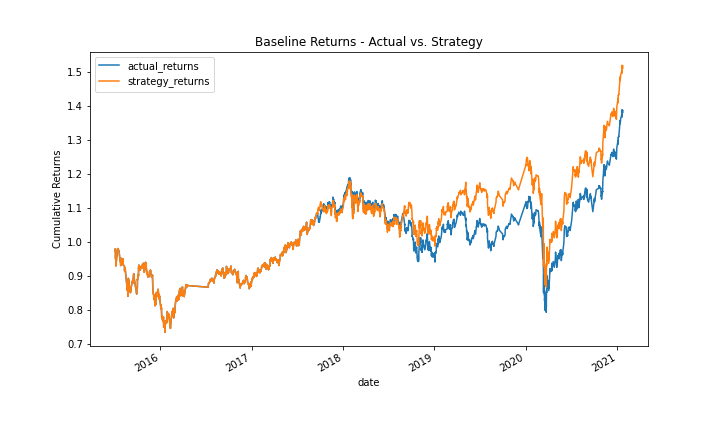
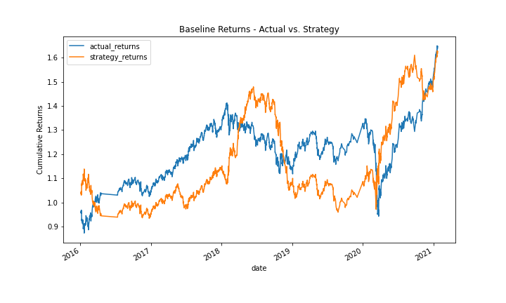
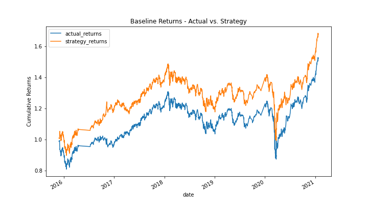
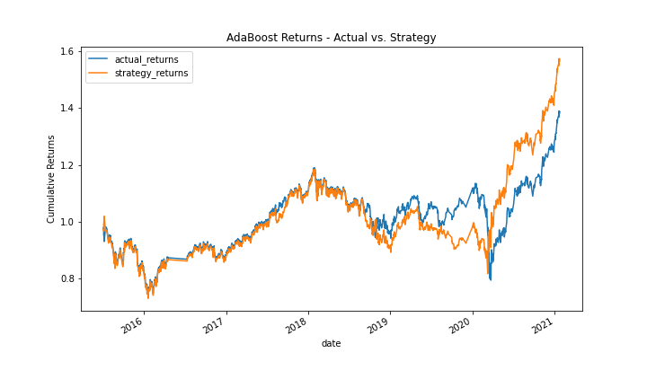

# Vectorized Backtesting

This analysis looks at the performance of models using fast and slow simple moving averages (SMA) as predictors of when to enter and exit a position.

 

## Overview of the Backtest  

The performance of the SMA strategy is compared to that of a simple buy-and-hold strategy. The baseline performance of the model-driven strategy is established, then features modification and different models are tested to determine the effectiveness of the strategy.  

 

## Technologies

This analysis leverages python 3.7 with the following packages:

- [numpy](https://numpy.org/) - For numerical operations  
- [pandas](https://pandas.pydata.org/) - For analyzing and transforming data   
- [scikit-learn](https://scikit-learn.org/stable/) - For predictive data analysis  
- [matplotlib](https://matplotlib.org/) - For visualizing data  

 

## Baseline Results

A SVM with default settings for the hyperparameters was used to establish a baseline for model performance. The model was trained with three months of data using a fast SMA of 4 and a slow SMA of 100 as features, and a binary target indicating whether returns were positive or negative based on the features from the prior period.  

The baseline accuracy was 55%, just barely better than random. The chart below reflects this. The strategy returns mirror the shape of the actual returns, and are only slightly better.

### Tuned Baseline Results

__Additional Training Data__

Training the model with nine months of data, instead of three months, and keeping all other parameters consistent produced worse results. Accuracy dropped to 53%, and strategy returns lag those of the actual returns for the majority of the test period. This is likely due to the model overfitting the training data.

  

__Alternate Fast and Slow SMAs__

The training window was reset to three months and the Fast and Slow SMAs were set to 12 and 120, respectively. Accuracy ticked up just slightly to 56%. As with the original parameters, the strategy returns movements mirror those of the actual returns, but with the increased windows, the strategy maintains higher cumulative returns for the duration of the backtest.  

 

## Alternative 1 Results  

The AdaBoost classification model was tested as an alternative to the SVM to determine if better performance could be obtained using a different model. The accuracy remained unchanged with the AdaBoost classifier, 55%. 

  

 

## Summary  

The baseline performance of 55% accuracy, nor the maximum achieved performance of 56% accuracy, realize the promise of algorithmic trading. Testing minor alterations to the training features and different models suggest that either, or both, better features and feature engineering is required or a different strategy is required to meaningfully improve performance.  

## Contributors

Josh Mischung: [josh@knoasis.io](josh@knoasis.io), [LinkedIn](https://www.linkedin.com/in/joshmischung/)

 

## License

MIT License

Copyright (c) [2022] [Joshua Mischung]

Permission is hereby granted, free of charge, to any person obtaining a copy
of this software and associated documentation files (the "Software"), to deal
in the Software without restriction, including without limitation the rights
to use, copy, modify, merge, publish, distribute, sublicense, and/or sell
copies of the Software, and to permit persons to whom the Software is
furnished to do so, subject to the following conditions:

The above copyright notice and this permission notice shall be included in all
copies or substantial portions of the Software.

THE SOFTWARE IS PROVIDED "AS IS", WITHOUT WARRANTY OF ANY KIND, EXPRESS OR
IMPLIED, INCLUDING BUT NOT LIMITED TO THE WARRANTIES OF MERCHANTABILITY,
FITNESS FOR A PARTICULAR PURPOSE AND NONINFRINGEMENT. IN NO EVENT SHALL THE
AUTHORS OR COPYRIGHT HOLDERS BE LIABLE FOR ANY CLAIM, DAMAGES OR OTHER
LIABILITY, WHETHER IN AN ACTION OF CONTRACT, TORT OR OTHERWISE, ARISING FROM,
OUT OF OR IN CONNECTION WITH THE SOFTWARE OR THE USE OR OTHER DEALINGS IN THE
SOFTWARE.
