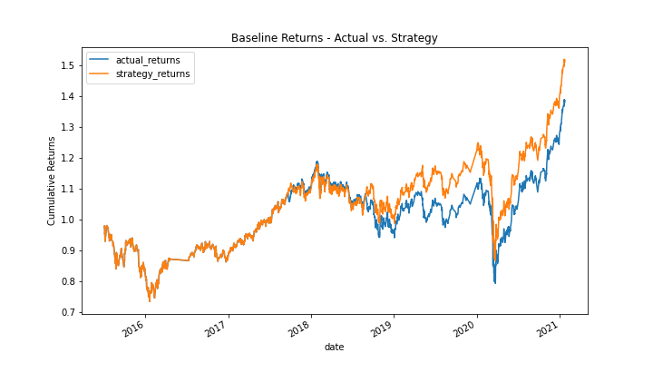

# Vectorized Backtesting

Just after the title, introduce your project by describing attractively what the project is about and what is the main problem that inspires you to create this project or what is the main contribution for the potential user of your project.

 

## Overview of the Backtest  

Lorem ipsum dolor sit amet, consectetur adipiscing elit. Sed aliquet purus erat, et vulputate eros consectetur sed. Fusce molestie enim nec tellus luctus finibus. In congue nec ligula eu vulputate. Praesent eget tristique lectus. Vestibulum eros ipsum, ultrices interdum vehicula fermentum, molestie vel velit.  

 

## Technologies

Describe the technologies required to use your project such as programming languages, libraries, frameworks, and operating systems. Be sure to include the specific versions of any critical dependencies that you have used in the stable version of your project.

 

## Baseline Results

A Support Vector Machine with default settings for the hyperparameters was used to establish a baseline for model performance. The model was trained with a fast SMA of 4 and a slow SMA of 4 100, respectively as features, and a binary target indicating whether returns were positive or negative based on the features from the prior period.  

The baseline accuracy was 55%, just barely better than random. The chart below reflects this. The strategy returns mirror the shape of the actual returns, and are only slightly better.

### Tuned Baseline Results

TLorem ipsum dolor sit amet, consectetur adipiscing elit. Sed aliquet purus erat, et vulputate eros consectetur sed. Fusce molestie enim nec tellus luctus finibus. In congue nec ligula eu vulputate. Praesent eget tristique lectus.  

 

## Alternative 1 Results  

Lorem ipsum dolor sit amet, consectetur adipiscing elit. Sed aliquet purus erat, et vulputate eros consectetur sed. Fusce molestie enim nec tellus luctus finibus. In congue nec ligula eu vulputate. Praesent eget tristique lectus.  

 

## Contributors

Josh Mischung: [josh@knoasis.io](josh@knoasis.io), [LinkedIn](https://www.linkedin.com/in/joshmischung/)

 

## License

MIT License

Copyright (c) [2022] [Joshua Mischung]

Permission is hereby granted, free of charge, to any person obtaining a copy
of this software and associated documentation files (the "Software"), to deal
in the Software without restriction, including without limitation the rights
to use, copy, modify, merge, publish, distribute, sublicense, and/or sell
copies of the Software, and to permit persons to whom the Software is
furnished to do so, subject to the following conditions:

The above copyright notice and this permission notice shall be included in all
copies or substantial portions of the Software.

THE SOFTWARE IS PROVIDED "AS IS", WITHOUT WARRANTY OF ANY KIND, EXPRESS OR
IMPLIED, INCLUDING BUT NOT LIMITED TO THE WARRANTIES OF MERCHANTABILITY,
FITNESS FOR A PARTICULAR PURPOSE AND NONINFRINGEMENT. IN NO EVENT SHALL THE
AUTHORS OR COPYRIGHT HOLDERS BE LIABLE FOR ANY CLAIM, DAMAGES OR OTHER
LIABILITY, WHETHER IN AN ACTION OF CONTRACT, TORT OR OTHERWISE, ARISING FROM,
OUT OF OR IN CONNECTION WITH THE SOFTWARE OR THE USE OR OTHER DEALINGS IN THE
SOFTWARE.
